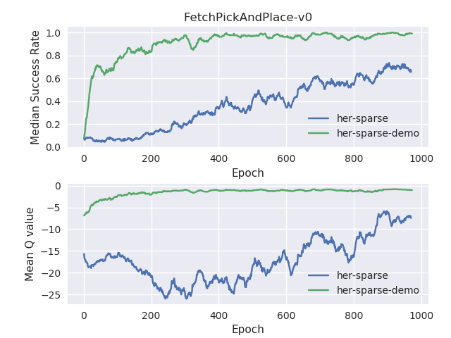

# Using-DDPG-and-HER-with-Demos
Implementation of the Deep Deterministic Policy gradient and Hindisight Experience Replay algorithms along with demonstrations help achieve faster success rate for a Pick and Place task in mujoco environment. 


> Note: This repository is a modification of baselines from OpenAI

## Results
Training with demonstrations helps overcome the exploration problem and achieves a faster and better convergence. The following graphs contrast the difference between training with and without demonstration data, I report the the mean Q values vs Epoch and the Success Rate vs Epoch:

<div class="imgcap" align="middle">
<center></center>
<div class="thecap" align="middle"><b>Training results for Fetch Pick and Place task constrasting between training with and without demonstration data.</b></div>
</div>

<p></p>


Clearly, the use of demonstrations enables a faster and better convergence in the Q values as apparent from the graphs. Also the success condition is achieved much faster reaching upto 100% performance just around the 400th epoch whereas in the case without demonstrations even after 1000 iterations the agent hardly reaches 70% success rate (Check under /assets for the Final training video which shows Fetch Robot doing the Pick and Place task). The video shows the agent's learned behavior corresponding to the pick and place task in a perfect manner.


## Installation 
1. Install Python 3.5 or higher on a 16.04 Ubuntu machine with enough GPU (ex. Lambda PC)

2. Clone this package in your working directory with `git clone xxx`

3. Add this package to your PYTHONPATH or if you are not familiar with that alternatively edit `sys.path.append('/path/to/your-file/')`  in **train.py**, **play.py** and **config.py**


## Environments
I'm solving a Pick and Place tasks in a Mujoco environment using Fetch robotic environments from OpenAI gym (https://gym.openai.com/envs/FetchPickAndPlace-v1/)


The learning algorithm is agnostic of the simulation environment used. With the help of [Gym-gazebo](https://github.com/erlerobot/gym-gazebo), the simulation environment in gazebo can be used as a stanalone gym environment with all the gym functionalities. But I used Mujoco along with OpenAI. 
 

<div class="imgcap" align="middle">
<center></center>
<div class="thecap" align="middle"><b>Learned behavior on a Fetch Arm simulation</b></div>
</div>


## File descriptions and Usage
The training paradigm to teach a task to an agent through previously recorded demonstrations involves:

### [Training](experiments/train.py)
Configure the run parameters at the bottom of the file, select the environment you wish to use by changing the environment name, additional parameters since the her baselines are:
- '--bc_loss', type=int, default=0, help='whether or not to use the behavior cloning loss as an auxilliary loss'
- '--q_filter', type=int, default=0, help='whether or not a Q value filter should be used on the Actor outputs'
- '--num_demo', type=int, default = 0, help='number of expert demo episodes'.

Edit `demoFileName = 'your/demo/file'` to point to the file that contains your recorded demonstrations
To start the training use `python experiment/train.py`.

### [Playing](experiments/play.py)
The above training paradigm spits out policies as .pkl files after every 5 epochs (can be modified) which we can then replay and evaluate with this file. To play the policy execute `python experiments/play.py /path/to/saved/policy.pkl`.

### [Configuration](experiments/config.py)
All the training hyperparameters can be configured through this file. Feel free to experiment with different combinations and record results.

### [DDPG agent](ddpg.py)
Contains the main DDPG algorithm with a modified network where the losses are changed based on the whether demonstrations are provided for the task. Basically we maintain a separate demoBuffer and sample from this as well. Following parameters are to be configured here:
- self.demo_batch_size: Number of demos out of total buffer size (128/1024 default)
- self.lambda1, self.lambda2: Correspond to the weights given for Q loss and Behavior cloning loss respectively


Major contributions of the paper include the following aspects which I have tried to implement over the HER baselines:

## Demonstration Buffer used along with the exploration replay buffer
First, we maintain a second replay buffer R<sub>D</sub> where we store our demonstration data in the same format as R. In each minibatch, we draw an extra N<sub>D</sub> examples from R<sub>D</sub> to use as off-policy replay data  for the update step. These examples are included in both the actor and critic update.

```python

self.demo_batch_size = 128 #Number of demo samples

def initDemoBuffer(self, demoDataFile, update_stats=True): 
#To initiaze the demobuffer with the recorded demonstration data. We also normalize the demo data.

def sample_batch(self):
    if self.bc_loss:
        transitions = self.buffer.sample(self.batch_size - self.demo_batch_size)
        global demoBuffer

        transitionsDemo = demoBuffer.sample(self.demo_batch_size)
        for k, values in transitionsDemo.items():
            rolloutV = transitions[k].tolist()
            for v in values:
                rolloutV.append(v.tolist())
            transitions[k] = np.array(rolloutV)
    else:
        transitions = self.buffer.sample(self.batch_size)

```


## Behavior Cloning Loss applied on the actor's actions
Second, we introduce a new loss computed only on the demonstration examples for training the actor. This loss is a standard loss in imitation learning, but we show that using it as an  auxiliary loss for RL improves learning significantly. The loss implementation can be seen in the following code.


## Q-value filter to account for imperfect demonstrations
We account for the possibility that demonstrations can be suboptimal by applying the behavior cloning loss only to states  where  the  critic Q(s,a)  determines  that  the  demonstrator action is better than the actor action. In python this looks like:

```python

self.lambda1 = 0.001
self.lambda2 =  0.0078

def _create_network(self, reuse=False):

	mask = np.concatenate((np.zeros(self.batch_size - self.demo_batch_size), np.ones(self.demo_batch_size)), axis = 0)

	target_Q_pi_tf = self.target.Q_pi_tf
    clip_range = (-self.clip_return, 0. if self.clip_pos_returns else np.inf)
    target_tf = tf.clip_by_value(batch_tf['r'] + self.gamma * target_Q_pi_tf, *clip_range) # y = r + gamma*Q(pi)
    self.Q_loss_tf = tf.reduce_mean(tf.square(tf.stop_gradient(target_tf) - self.main.Q_tf)) #(y-Q(critic))^2

    if self.bc_loss ==1 and self.q_filter == 1 :
        maskMain = tf.reshape(tf.boolean_mask(self.main.Q_tf > self.main.Q_pi_tf, mask), [-1]) #where is the demonstrator action better than actor action according to the critic?
        self.cloning_loss_tf = tf.reduce_sum(tf.square(tf.boolean_mask(tf.boolean_mask((self.main.pi_tf), mask), maskMain, axis=0) - tf.boolean_mask(tf.boolean_mask((batch_tf['u']), mask), maskMain, axis=0)))
        self.pi_loss_tf = -self.lambda1 * tf.reduce_mean(self.main.Q_pi_tf)
        self.pi_loss_tf += self.lambda1 * self.action_l2 * tf.reduce_mean(tf.square(self.main.pi_tf / self.max_u))
        self.pi_loss_tf += self.lambda2 * self.cloning_loss_tf

    elif self.bc_loss == 1 and self.q_filter == 0:
        self.cloning_loss_tf = tf.reduce_sum(tf.square(tf.boolean_mask((self.main.pi_tf), mask) - tf.boolean_mask((batch_tf['u']), mask)))
        self.pi_loss_tf = -self.lambda1 * tf.reduce_mean(self.main.Q_pi_tf)
        self.pi_loss_tf += self.lambda1 * self.action_l2 * tf.reduce_mean(tf.square(self.main.pi_tf / self.max_u))
        self.pi_loss_tf += self.lambda2 * self.cloning_loss_tf

    else:
        self.pi_loss_tf = -tf.reduce_mean(self.main.Q_pi_tf)
        self.pi_loss_tf += self.action_l2 * tf.reduce_mean(tf.square(self.main.pi_tf / self.max_u))
        self.cloning_loss_tf = tf.reduce_sum(tf.square(self.main.pi_tf - batch_tf['u'])) #random values
```
Here, we first mask the samples such as to get the cloning loss only on the demonstration samples by using the `tf.boolean_mask` function. We have 3 types of losses depending on the chosen run-paramters. When using both behavior cloning loss with Q_Filter we create another mask that enables us to apply the behavior cloning loss to only those states where the critic Q(s,a) determines that the demonstrator action is better than the actor action.


## Generating demonstrations
The first step is to generate the demonstration dataset. This can be done in two ways, either by using a VR system to manipulate the arm using physical VR trackers or the simpler way is to write a script to carry out the respective task. Now some tasks can be complex and thus it would be difficult to write a hardcoded script for that task (eg. Fetch Push), but here our focus is on providing an algorithm that helps the agent to learn from demonstrations, and not on the demonstration generation paradigm itself. Thus the data collection part is left to the reader's choice.

I have provided a script for the Fetch Pick and Place task, to generate demonstrations for the Pick and Place task execute:
```bash
python experiment/data_generation/fetch_data_generation.py
```
This outputs ```data_fetch_random_100.npz``` file which is our data file, which are 100 perfect demonstrations done by the Fetch Robot using its own physics model. 

## Training details and Hyperparameters
We train the robot with the above shown demonstrations in the buffer. We sample a total of 100 demonstrations/rollouts and in every minibatch sample N<sub>D</sub> = 128 samples from the demonstrations in a total of N = 1024 samples, the rest of the samples are generated when the arm interacts with the environment. To train the model we use Adam optimizer with learning rate 0.001 for both critic and actor networks. The discount factor is 0.98. To explore during training, we sample random actions uniformly within the action space with a probability of 0.1 at every step, with an additional uniform gaussian noise which is 10% of the maximum value of each action dimension. For details about more hyperparameters, refer to config.py in the source code. Both the environments are trained with the same set of hyperparameters for now in the reported results.

These parameters can be changed either in [experiment/config.py](experiment/config.py) or passed to the command line as `--param=value`)


